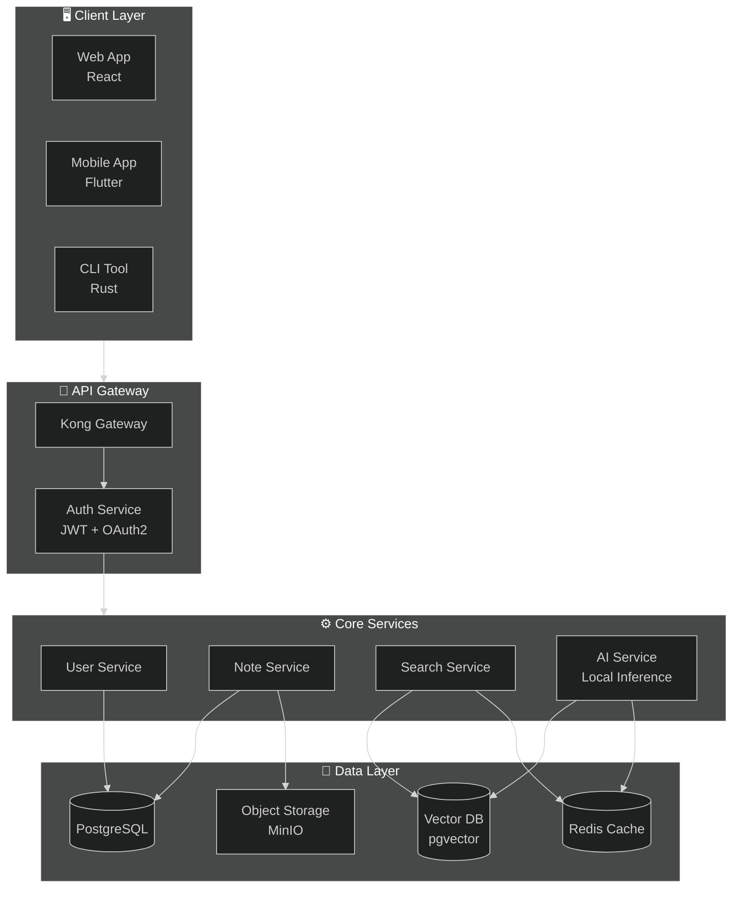
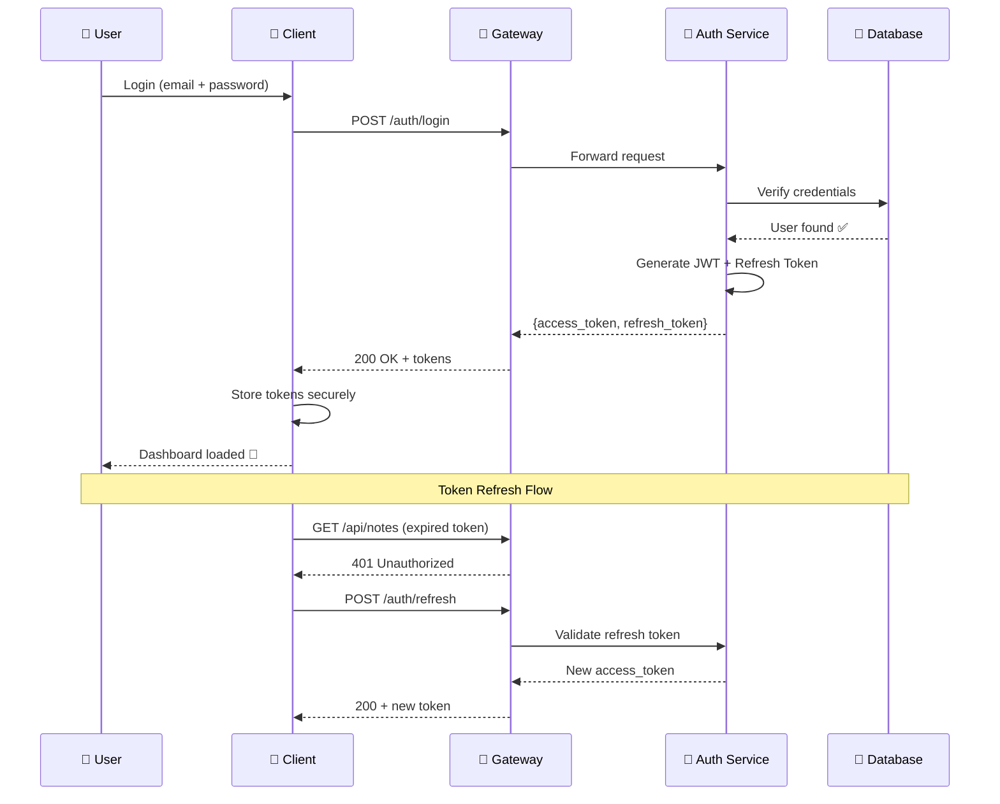
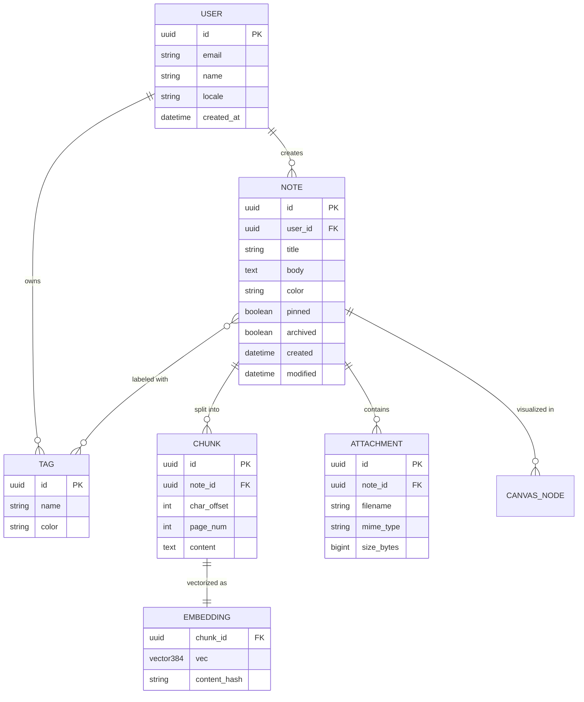
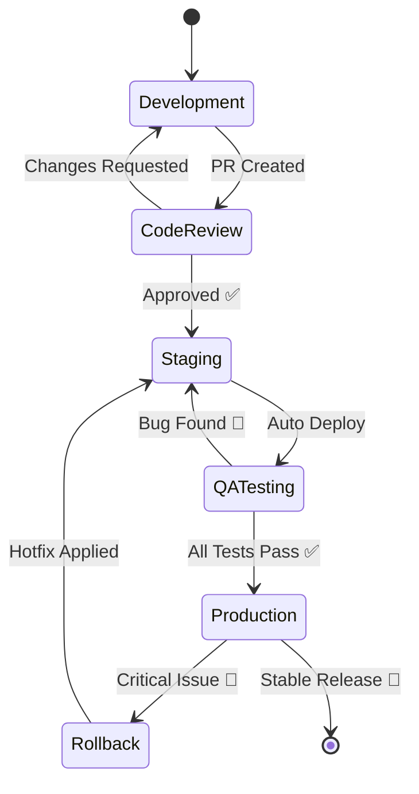
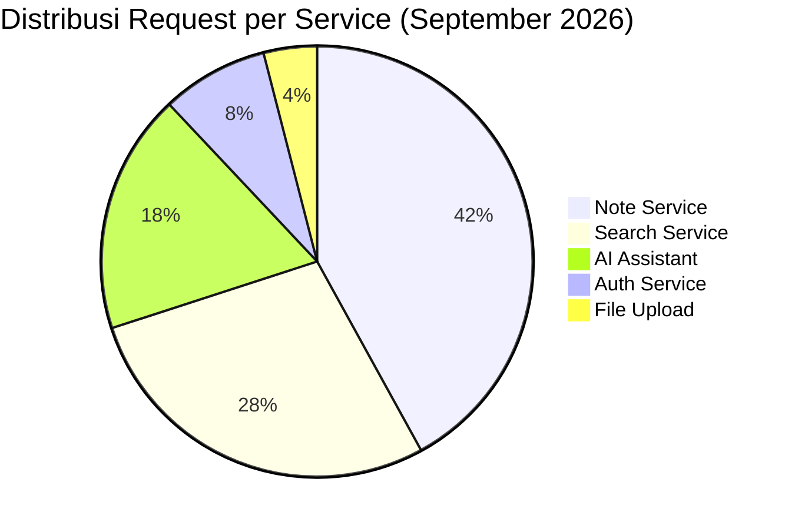
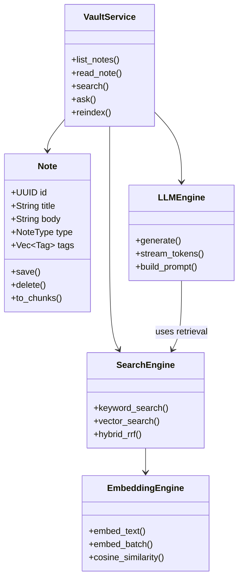

# 🏗️ Arsitektur Microservice Platform AI ^sgeysr

Dokumen arsitektur teknis untuk [[Proyek Startup AI]]. ^0u1tfv

## Diagram Utama ^8hzvg7

Arsitektur keseluruhan sistem: ^5wdr68

^7pvdcy

## Alur Autentikasi ^byy4d9

^15g3rf

## Entity Relationship — Data Model ^hinida

^tz73n4

## Status Deployment Pipeline ^5dzmey

^kz2vxp

## Distribusi Trafik ^kiav5p

^2u7hun

## Class Diagram — Core Domain ^e32ehx

^rq7o4r

> [!note] Performa Rendering Mermaid ^q5927v
> Semua diagram di atas dirender **native dalam Rust** tanpa JavaScript/WebView. ^vdlgwc
> Flowchart 550 node dirender dalam ~20ms (release build). ^3cv8nf
> Diagram tipikal seperti di atas < 1ms. ^zpd9lp

Lihat juga: [[Database Schema]] untuk detail skema database. ^sfs2vz

#arsitektur #backend #microservice #diagram ^k8z3u0
