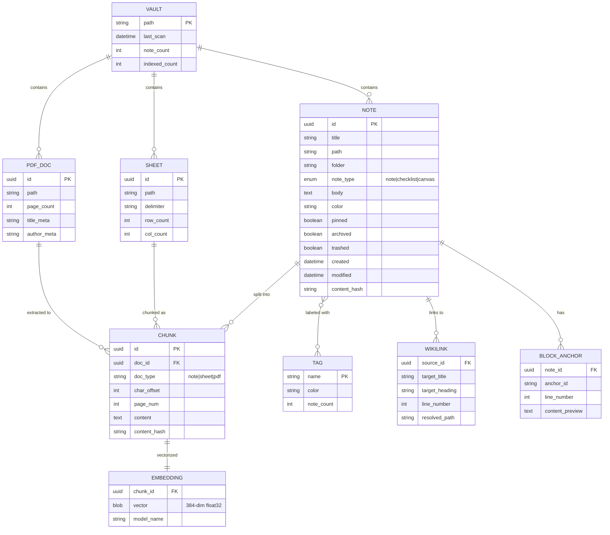

# 🗄️ Database Schema — Platform AI

Skema database untuk [[Proyek Startup AI]]. Arsitektur lengkap di [[Arsitektur Microservice]].

## ER Diagram



## Tabel SQLite Index

> [!note] Index ≠ Source of Truth
> SQLite hanya menyimpan **index cache**. Source of truth selalu file `.md`
> di disk. Index bisa dihapus dan dibangun ulang kapan saja.

### `notes_index`

```sql
CREATE TABLE notes_index (
    id          TEXT PRIMARY KEY,
    title       TEXT NOT NULL,
    path        TEXT NOT NULL UNIQUE,
    folder      TEXT DEFAULT '',
    note_type   TEXT DEFAULT 'note',
    color       TEXT DEFAULT 'default',
    pinned      INTEGER DEFAULT 0,
    archived    INTEGER DEFAULT 0,
    trashed     INTEGER DEFAULT 0,
    created     TEXT NOT NULL,
    modified    TEXT NOT NULL,
    content_hash TEXT,
    has_canvas  INTEGER DEFAULT 0
);

CREATE INDEX idx_notes_folder ON notes_index(folder);
CREATE INDEX idx_notes_modified ON notes_index(modified DESC);
```

### `chunks` + FTS5

```sql
CREATE TABLE chunks (
    id            TEXT PRIMARY KEY,
    doc_id        TEXT NOT NULL,
    doc_type      TEXT DEFAULT 'note',
    file_path     TEXT NOT NULL,
    page_num      INTEGER,
    char_offset   INTEGER NOT NULL,
    content       TEXT NOT NULL,
    content_hash  TEXT
);

-- Full-text search index (keyword/BM25)
CREATE VIRTUAL TABLE chunks_fts USING fts5(
    content,
    content=chunks,
    content_rowid=rowid
);

-- Vector embeddings (semantic search via sqlite-vec)
CREATE VIRTUAL TABLE chunks_vec USING vec0(
    chunk_id TEXT PRIMARY KEY,
    embedding FLOAT[384]
);
```

### `links`

```sql
CREATE TABLE links (
    source_id      TEXT NOT NULL,
    target_title   TEXT NOT NULL,
    target_heading TEXT,
    line_number    INTEGER,
    resolved_path  TEXT,
    UNIQUE(source_id, target_title, line_number)
);

CREATE INDEX idx_links_target ON links(target_title);
```

## Query Patterns

### Hybrid Search (RRF)

```sql
-- 1. Keyword search via FTS5
SELECT doc_id, snippet(chunks_fts, 0, '<b>', '</b>', '...', 32) as snippet,
       rank as bm25_score
FROM chunks_fts
WHERE chunks_fts MATCH ?
ORDER BY rank
LIMIT 20;

-- 2. Semantic search via sqlite-vec
SELECT chunk_id, distance
FROM chunks_vec
WHERE embedding MATCH ?
  AND k = 20
ORDER BY distance;

-- 3. Combine with RRF in application layer
```

### Backlinks Query

```sql
SELECT n.id, n.title, n.path, l.line_number
FROM links l
JOIN notes_index n ON n.id = l.source_id
WHERE l.target_title = ? COLLATE NOCASE
   OR l.target_title = ? COLLATE NOCASE  -- file stem
ORDER BY n.modified DESC;
```

Lihat juga: [[Arsitektur Microservice#Entity Relationship — Data Model]]

#database #schema #backend #SQL
