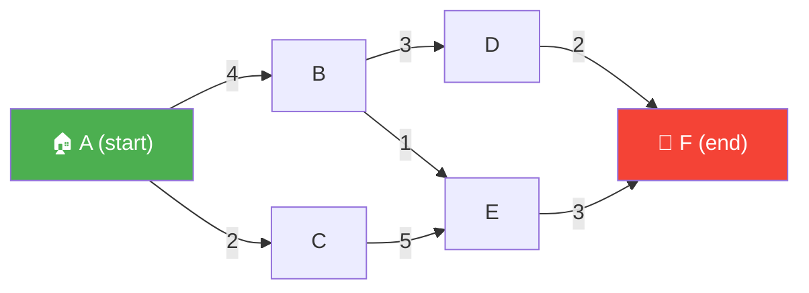

# 📐 Algoritma Graph — Catatan Kuliah

## Definisi Dasar

**Graph** G = (V, E) terdiri dari:
- **V** = himpunan vertex (node) ^def-vertex
- **E** = himpunan edge (sisi) yang menghubungkan pasangan vertex ^def-edge

## Jenis Graph

| Jenis              | Directed? | Weighted? | Contoh                  |
|---------------------|-----------|-----------|-------------------------|
| Undirected          | ❌        | ❌        | Jaringan pertemanan     |
| Directed (Digraph)  | ✅        | ❌        | Twitter follow          |
| Weighted            | ❌        | ✅        | Peta jarak kota         |
| DAG                 | ✅        | ❌        | Dependency resolution   |
| Bipartite           | ❌        | ❌        | Matching pekerjaan      |
| Complete (Kₙ)       | ❌        | ❌        | Round-robin tournament  |

## Representasi Graph

### Adjacency List (yang digunakan Mnemonic)

```rust
use std::collections::HashMap;

struct Graph {
    adjacency: HashMap<NodeId, Vec<(NodeId, f32)>>, // (neighbor, weight)
}

impl Graph {
    fn add_edge(&mut self, from: NodeId, to: NodeId, weight: f32) {
        self.adjacency.entry(from).or_default().push((to, weight));
        self.adjacency.entry(to).or_default().push((from, weight)); // undirected
    }

    fn neighbors(&self, node: NodeId) -> &[(NodeId, f32)] {
        self.adjacency.get(&node).map_or(&[], |v| v.as_slice())
    }

    fn degree(&self, node: NodeId) -> usize {
        self.neighbors(node).len()
    }
}
```

### Adjacency Matrix

```rust
struct MatrixGraph {
    matrix: Vec<Vec<f32>>,  // matrix[i][j] = weight, 0 = no edge
    size: usize,
}
```

> [!note] Mnemonic menggunakan adjacency list
> Knowledge graph di Mnemonic menggunakan adjacency list karena
> graph catatan biasanya sparse (setiap catatan hanya terhubung
> ke beberapa catatan lain, bukan semua).

## Algoritma Traversal

### BFS (Breadth-First Search) ^bfs-algo

Menjelajahi graph level per level — cocok untuk mencari jalur terpendek
pada graph tanpa bobot.

```rust
use std::collections::{HashSet, VecDeque};

fn bfs(graph: &Graph, start: NodeId) -> Vec<NodeId> {
    let mut visited = HashSet::new();
    let mut queue = VecDeque::new();
    let mut order = Vec::new();

    queue.push_back(start);
    visited.insert(start);

    while let Some(node) = queue.pop_front() {
        order.push(node);
        for &(neighbor, _) in graph.neighbors(node) {
            if visited.insert(neighbor) {
                queue.push_back(neighbor);
            }
        }
    }
    order
}
```

**Kompleksitas:** O(V + E) waktu, O(V) ruang

### DFS (Depth-First Search) ^dfs-algo

Menjelajahi sedalam mungkin sebelum mundur — cocok untuk deteksi siklus,
topological sort, dan connected components.

```rust
fn dfs(graph: &Graph, start: NodeId) -> Vec<NodeId> {
    let mut visited = HashSet::new();
    let mut stack = vec![start];
    let mut order = Vec::new();

    while let Some(node) = stack.pop() {
        if visited.insert(node) {
            order.push(node);
            for &(neighbor, _) in graph.neighbors(node).iter().rev() {
                if !visited.contains(&neighbor) {
                    stack.push(neighbor);
                }
            }
        }
    }
    order
}
```

**Kompleksitas:** O(V + E) waktu, O(V) ruang

## Shortest Path — Dijkstra ^dijkstra



Jalur terpendek A → F: **A → B → E → F** (total: 4 + 1 + 3 = **8**)

```rust
use std::collections::BinaryHeap;
use std::cmp::Reverse;

fn dijkstra(graph: &Graph, start: NodeId, end: NodeId) -> Option<(f32, Vec<NodeId>)> {
    let mut dist: HashMap<NodeId, f32> = HashMap::new();
    let mut prev: HashMap<NodeId, NodeId> = HashMap::new();
    let mut heap = BinaryHeap::new();

    dist.insert(start, 0.0);
    heap.push(Reverse((0.0_f32, start)));

    while let Some(Reverse((cost, node))) = heap.pop() {
        if node == end {
            // Reconstruct path
            let mut path = vec![end];
            let mut current = end;
            while let Some(&p) = prev.get(&current) {
                path.push(p);
                current = p;
            }
            path.reverse();
            return Some((cost, path));
        }

        if cost > *dist.get(&node).unwrap_or(&f32::MAX) {
            continue;
        }

        for &(neighbor, weight) in graph.neighbors(node) {
            let new_cost = cost + weight;
            if new_cost < *dist.get(&neighbor).unwrap_or(&f32::MAX) {
                dist.insert(neighbor, new_cost);
                prev.insert(neighbor, node);
                heap.push(Reverse((new_cost, neighbor)));
            }
        }
    }
    None
}
```

## Canvas & Block Binding

> Di Mnemonic, buka **Canvas mode** untuk melihat diagram visual dari catatan ini.
> Node-node canvas **terikat ke block reference** di atas:
> - Node "BFS" terikat ke `^bfs-algo` — edit di Markdown, canvas otomatis update
> - Node "DFS" terikat ke `^dfs-algo`
> - Node "Dijkstra" terikat ke `^dijkstra`
> - Node "Vertex" terikat ke `^def-vertex`
> - Node "Edge" terikat ke `^def-edge`

## Aplikasi di Mnemonic

Graph digunakan di Mnemonic untuk:
1. **Knowledge Graph** — catatan = node, wikilink = edge
2. **Backlinks** — menemukan catatan yang mereferensikan catatan lain
3. **Similarity Graph** — edge berbobot dari cosine similarity embedding
4. **Force-Directed Layout** — visualisasi interaktif di graph view

Lihat juga: [[Machine Learning 101]] untuk teori embedding, [[Jurnal Riset NLP]] untuk aplikasi.

#kuliah #algoritma #graph #CS
