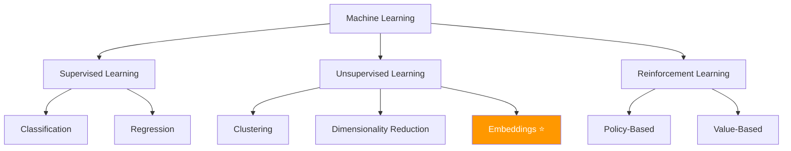
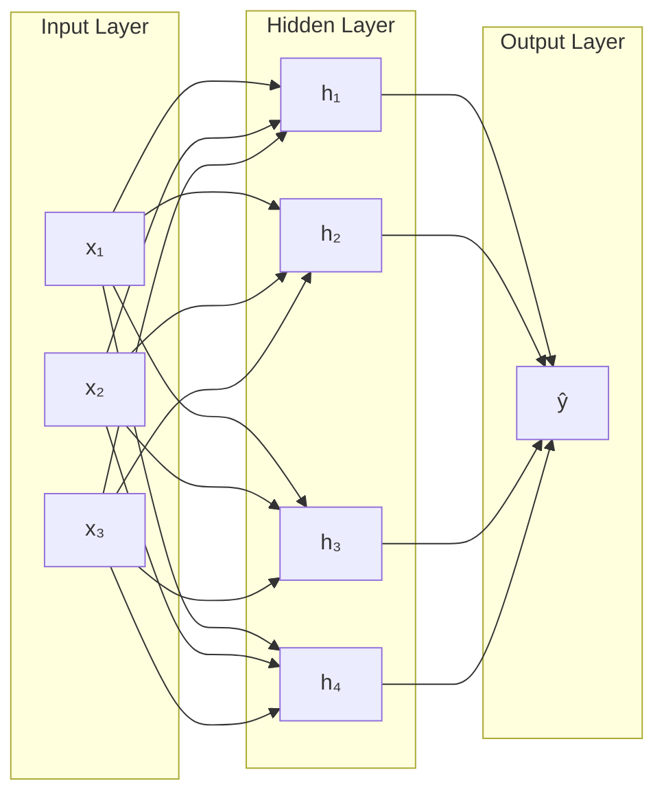

# 🧪 Machine Learning 101 — Catatan Kuliah

## Apa itu Machine Learning?

Machine Learning adalah cabang AI dimana komputer **belajar dari data**
tanpa diprogram secara eksplisit untuk setiap kasus. ^definisi-ml

> [!tip] Relevansi untuk Mnemonic
> Mnemonic menggunakan ML untuk dua hal utama:
> 1. **Embedding** — mengubah teks menjadi vektor untuk pencarian semantik
> 2. **LLM Inference** — menghasilkan jawaban dari model bahasa lokal

## Taxonomy ML



## Text Embeddings ^embedding-theory

Embedding adalah representasi teks sebagai **vektor numerik** di ruang berdimensi tinggi,
dimana teks dengan makna mirip memiliki vektor yang berdekatan.

### Cosine Similarity

```
similarity(A, B) = (A · B) / (||A|| × ||B||)
```

- Nilai 1.0 = identik
- Nilai 0.0 = tidak terkait
- Nilai -1.0 = berlawanan

### Contoh Implementasi

```rust
fn cosine_similarity(a: &[f32], b: &[f32]) -> f32 {
    assert_eq!(a.len(), b.len());

    let dot: f32 = a.iter().zip(b).map(|(x, y)| x * y).sum();
    let norm_a: f32 = a.iter().map(|x| x * x).sum::<f32>().sqrt();
    let norm_b: f32 = b.iter().map(|x| x * x).sum::<f32>().sqrt();

    if norm_a == 0.0 || norm_b == 0.0 {
        return 0.0;
    }
    dot / (norm_a * norm_b)
}
```

### Kenapa 384 Dimensi?

Model `multilingual-e5-small` menghasilkan vektor 384 dimensi. ^why-384

| Dimensi | Model              | Trade-off                        |
|---------|--------------------|---------------------------------|
| 384     | e5-small ⭐        | Cepat, akurat, hemat memori     |
| 768     | e5-base            | Lebih akurat, 2x lebih lambat   |
| 1024    | e5-large           | Paling akurat, butuh banyak RAM |

> Untuk Mnemonic, 384 dimensi sudah cukup karena catatan personal
> biasanya lebih pendek dan kontekstual dibanding dokumen akademis.

## Neural Networks Dasar ^neural-network



### Activation Functions

| Function   | Formula            | Digunakan untuk    |
|-----------|--------------------|--------------------|
| ReLU      | max(0, x)          | Hidden layers      |
| Sigmoid   | 1/(1+e⁻ˣ)         | Binary output      |
| Softmax   | eˣⁱ/Σeˣʲ          | Multi-class output |
| GELU      | x·Φ(x)            | Transformers ⭐    |

## Transformer Architecture ^transformer

Arsitektur yang mendasari semua LLM modern termasuk Qwen 2.5:

1. **Self-Attention** — setiap token "melihat" semua token lain
2. **Multi-Head** — beberapa head attention berjalan paralel
3. **Feed-Forward** — layer dense setelah attention
4. **Layer Normalization** — stabilisasi training
5. **Positional Encoding** — memberikan informasi posisi

> [!important] Kenapa Transformer Penting?
> Semua model bahasa yang digunakan Mnemonic (Qwen 2.5, embedding model)
> berbasis arsitektur Transformer. Memahami ini membantu mengerti
> batasan dan kekuatan AI assistant.

## Quantization ^quantization

Teknik untuk mengecilkan model tanpa kehilangan banyak akurasi:

| Format   | Bits per param | Ukuran 1.5B model | Akurasi relatif |
|----------|---------------|---------------------|-----------------|
| FP32     | 32            | ~6 GB               | 100% (baseline) |
| FP16     | 16            | ~3 GB               | ~99.9%          |
| INT8     | 8             | ~1.5 GB             | ~99%            |
| **Q4_K_M** | **4**      | **~1.1 GB** ⭐      | **~97%**        |
| Q2_K     | 2             | ~0.6 GB             | ~90%            |

> Mnemonic menggunakan **Q4_K_M** — keseimbangan terbaik antara
> ukuran dan kualitas untuk hardware consumer.

## Referensi

- Vaswani et al., "Attention Is All You Need", NeurIPS 2017
- Devlin et al., "BERT: Pre-training of Deep Bidirectional Transformers", 2019
- Terkait: [[Jurnal Riset NLP]], [[Proyek Startup AI]]

#kuliah #ML #AI #dasar
